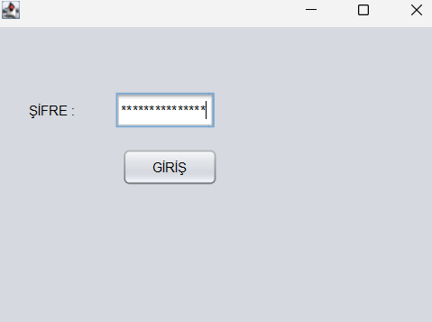
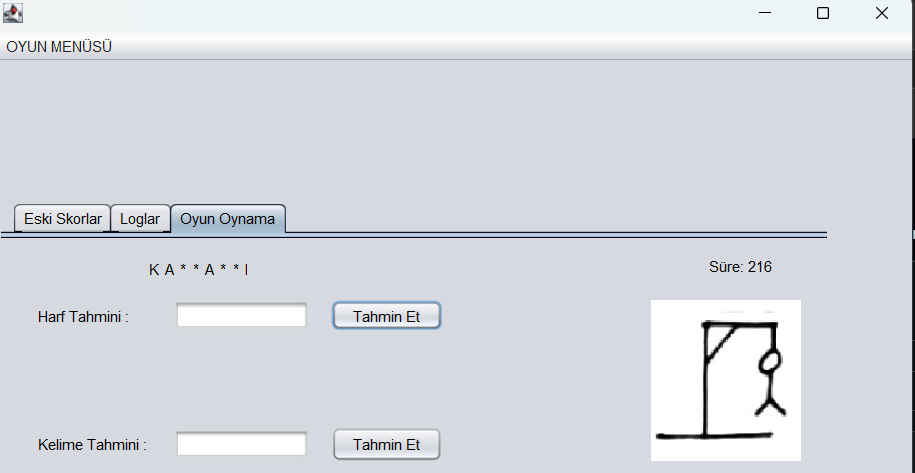
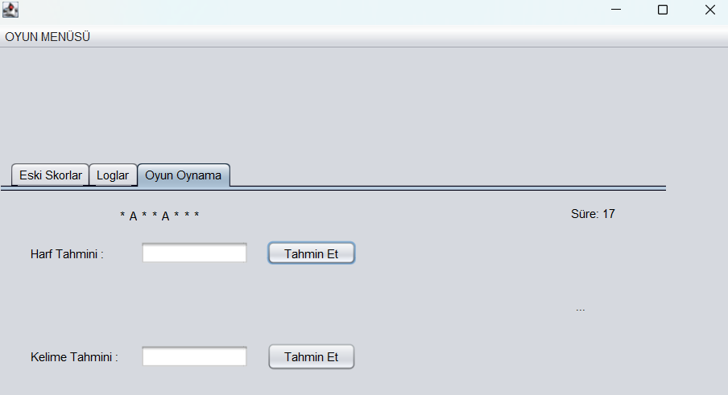
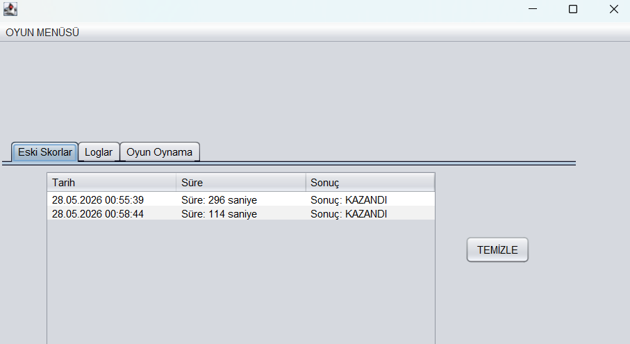
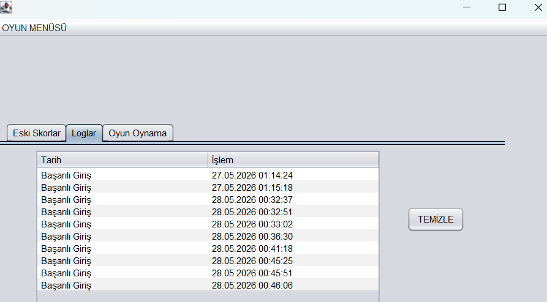

# 🎮 P2Oyun

### Adam Asmaca Oyunu

Java Swing ile geliştirilmiş, şifre korumalı, dosya tabanlı skor ve log takibi yapan bir Adam Asmaca (Hangman) masaüstü oyunudur. Programlama 2 dersi kapsamında geliştirilmiştir.

## ✨ Özellikler

- 🔐 **Şifre Korumalı Giriş:** Oyuna girmeden önce şifre ekranı karşılıyor; 3 yanlış denemede program otomatik kapanıyor.
- 🔤 **Harf ve Kelime Tahmini:** Hem tek tek harf hem de doğrudan kelimenin tamamı tahmin edilebiliyor.
- 🖼️ **Görsel Geri Bildirim:** Her yanlış tahminde adam asmaca resmi bir adım ilerliyor (11 hak).
- ⏱️ **Süre Sayacı:** `javax.swing.Timer` ile oyun süresi saniye saniye gösteriliyor.
- 💾 **Skor Kaydı:** Oyun sonuçları (tarih, süre, sonuç) `.txt` dosyasına kaydediliyor ve tabloda listeleniyor.
- 📝 **Log Sistemi:** Şifre girişleri (başarılı/başarısız) ve şifre oluşturma işlemleri loglanıyor.
- 🗑️ **Şifreli Temizleme:** Skorlar ve loglar, şifre doğrulaması yapılmadan silinemiyor.
- 📑 **Sekmeli Arayüz:** `JTabbedPane` ile "Eski Skorlar", "Loglar" ve "Oyun Oynama" sekmeleri arasında geçiş.

## 🛠️ Kullanılan Teknolojiler

- **Java 17**
- **Java Swing** (JFrame, JTabbedPane, JTable, JPasswordField, JOptionPane, Timer)
- **java.nio.file** (`Files.readAllLines`) ve **java.io** (`FileWriter`) ile dosya işlemleri
- **NetBeans** GUI Builder (GroupLayout)

## 📂 Proje Yapısı

```
src/
└── com/mycompany/p2oyun/
    ├── P2Oyun.java          # Ana oyun ekranı (oyun mantığı, skor/log tabloları)
    └── SifreEkrani.java     # Giriş öncesi şifre doğrulama ekranı
```

```
C:\P2Oyun\
├── Resimler\
│   ├── 1.jpg            # İlk aşama görseli
│   ├── ...
│   └── 11.jpg           # Son aşama (Oyun Bitti) görseli
└── TXTDosyalar\
    ├── kelimeler.txt    # Tahmin edilecek kelime havuzu
    ├── oyunlar.txt      # Geçmiş oyun skorlarının tutulduğu dosya
    ├── sifre.txt        # Giriş/temizleme şifresi
    └── log.txt          # Giriş ve işlem logları
```
\`\`\`

Oyunun çalışması için gereken metin ve resim dosyaları aşağıdaki sabit dizinlerde tutulur:

\`\`\`
C:\P2Oyun\TXTDosyalar\kelimeler.txt   # Tahmin edilecek kelime listesi
C:\P2Oyun\TXTDosyalar\oyunlar.txt     # Oyun sonuçları (skor kaydı)
C:\P2Oyun\TXTDosyalar\sifre.txt       # Giriş şifresi
C:\P2Oyun\TXTDosyalar\log.txt         # Giriş/işlem logları
C:\P2Oyun\Resimler\                   # Yanlış tahmin görselleri (1.jpg, 2.jpg, ...)
\`\`\`

## ⚙️ Nasıl Çalışır?

1. Program açıldığında önce **SifreEkrani** gösterilir.
   - Şifre dosyası boşsa kullanıcıdan yeni bir şifre oluşturması istenir.
   - Şifre dosyası doluysa girilen şifre kayıtlı şifre ile karşılaştırılır.
   - 3 yanlış denemede program kapanır.
2. Şifre doğrulandıktan sonra ana ekran (**P2Oyun**) açılır.
3. **"OYUN MENÜSÜ"** üzerinden *"Oyuna Başla"* seçilince `kelimeler.txt` dosyasından rastgele bir kelime seçilir ve harf sayısı kadar `*` içeren etiketler oluşturulur.
4. Kullanıcı tek harf ya da tüm kelimeyi tahmin edebilir:
   - Doğru harf bulunursa ilgili `*` karakterin yerini alır.
   - Yanlış tahminde asma görseli bir adım ilerler; 11 yanlış hakta oyun kaybedilir.
5. Oyun bitince sonuç (`KAZANDI` / `KAYBETTİ`), süresiyle birlikte `oyunlar.txt` dosyasına kaydedilir ve "Eski Skorlar" tablosunda görüntülenir.
6. "Eski Skorlar" ve "Loglar" sekmelerindeki **TEMİZLE** butonları, yalnızca doğru şifre girildiğinde ilgili dosyayı ve tabloyu sıfırlar.

## 📸 Ekran Görüntüleri

### Şifre Ekranı


### Oyun Oynama



### Eski Skorlar


### Loglar


## ▶️ Kurulum ve Çalıştırma

1. Projeyi NetBeans ile açın (paket adı: `com.mycompany.p2oyun`).
2. Yukarıdaki dizin yapısını (`C:\P2Oyun\...`) oluşturup gerekli `.txt` dosyalarını ve resimleri (`1.jpg`–`11.jpg`) ekleyin.
3. `P2Oyun.java` dosyasını çalıştırın.
4. Açılan şifre ekranından giriş yapıp oyuna başlayın.
